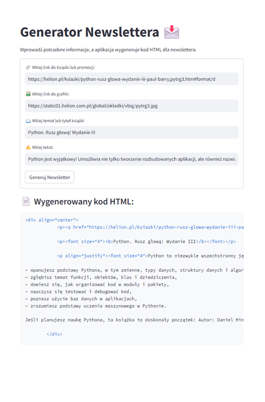

Generator Newsletterów to aplikacja oparta na Streamlit, która umożliwia generowanie kodu HTML dla newsletterów. Wykorzystuje model OpenAI GPT-4o do automatycznego parafrazowania treści i formatuje wynik w czytelnej strukturze HTML.

## Funkcjonalności

- Dodawanie linków do książek, promocji lub stron docelowych.

- Obsługa grafik – możliwość dodania linku do grafiki promocyjnej.

- Automatyczne parafrazowanie treści przy użyciu OpenAI GPT-4o.

- Generowanie kodu HTML gotowego do użycia w newsletterze.

## Uruchomienie aplikacji
### Instalacja pakietów

pip install streamlit openai

## Klucze API
### OpenAI

1. Założ konto na stronie https://platform.openai.com/
2. Przejdź do Settings -> Billing i dodaj kartę aby wykupić kredyty wymagane do korzystania z modeli OpenAI.
3. Opcjonalnie w sekcji Limits ustaw limity kwotowe, po wykorzystaniu których system zablokuje możliwość korzystania z modeli językowych.
4. W sekcji API Keys kliknij +Create new secret key, nazwij go i wygeneruj.
5. Zapisz klucz i nie udostępniaj nikomu.

Klucz najlepiej zapisać w zmiennej środowiskowej systemu operacyjnego. W moim przypadku jest to Windows 11 Home.

1. W wyszukiwarce Windows wpisz "zmienne środowiskowe" i kliknij Edytuj zmienne śodowiskowe systemu.
2. W otwartym oknie kliknij button Zmienne środowiskowe...
3. Kliknij button Nowa... i dodaj zmienną o nazwie OPENAI_API_KEY

## Uruchomienie aplikacji w Streamlit

1. Pobierz skrypt newsletter.py
2. Otwórz nowy terminal i wpisz streamlit run newsletter.py

## Jak korzystać?

1. Wprowadź dane do formularza:
- Link do książki/promocji
- Link do grafiki
- Tytuł książki
- Treść do sparafrazowania
2. Kliknij przycisk „Generuj Newsletter”.
3. Otrzymasz gotowy kod HTML, który możesz skopiować do swojego newslettera.

## Zrzuty ekranu

## Technologie

- Python
- Streamlit
- OpenAI GPT-4o
- HTML

## Autor
https://github.com/Robson2k7